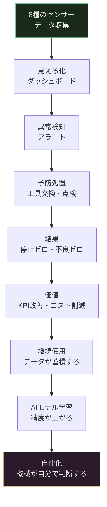

ある月曜日の朝、旋盤が止まった。

主軸軸受が壊れていた。前の週の金曜日には何ともなかった。少なくとも、誰もそう思っていた。

復旧に2日かかった。加工待ちのワークが詰まった。納期の調整が入った。

**「なぜ壊れるまで気づかなかったのか」**

この問いに答えられる人は、その現場にいなかった。

---

## 機械はずっと喋っていた

あの旋盤は、壊れる前から信号を出していた。

軸受が傷み始めたとき、主軸の振動パターンが変わっていた。摩擦が増えてモーターが少し多く電気を食い始めていた。軸受の温度が、ゆっくりと、しかし確実に上がっていた。加工音の中に、いつもとは違う周波数の音が混じり始めていた。

誰も聞いていなかっただけだ。

センサーを付けるとは、**その声を聞き始めること**だ。

---

## なぜ「8種類」なのか

回転体加工の機械が出す信号は、1種類ではない。それぞれの信号が、違うことを教えてくれる。

| # | センサーの種類 | 機械が教えてくれること | 設置の難しさ |
|---|---|---|---|
| 1 | **信号灯（ランプ色）** | 今、動いているか・止まっているか・アラームが出ているか | ★☆☆ とても簡単 |
| 2 | **電流** | モーターの頑張り具合・工具の疲労度・軸受の摩耗 | ★☆☆ ケーブルに挟むだけ |
| 3 | **重量** | ワークの重さ・どれだけ削ったか・材料の確認 | ★★☆ 台座への組み込み |
| 4 | **振動** | 軸受の傷・工具のビビリ・主軸のアンバランス | ★★☆ 本体に貼り付け |
| 5 | **音** | ビビリ音・工具折損の予兆・異常な機械音 | ★☆☆ マイクを近くに置く |
| 6 | **温度** | 主軸の熱変位・軸受の過熱・冷却液の状態 | ★☆☆ 接触型で貼り付け |
| 7 | **位置・RFID** | ワークが今どこにあるか・工具の使用履歴 | ★★☆ タグと読取機 |
| 8 | **画像** | 加工面のキズ・バリ・工具刃先の状態 | ★★★ カメラ設置と照明 |

全部を一度に付ける必要はない。**まず1番と2番から始めて、半年で元が取れる。** その後ゆっくり増やしていく。

---

## センサー1：信号灯　——「今、動いているか」が工場全体で見える

信号灯（赤・黄・緑の三色ランプ）に光センサーを取り付けるだけだ。機械を改造しない。ケーブルも切らない。

これだけで、**いつ止まったか・何分止まっていたか・何回アラームが出たか**が記録される。

現場の感覚では「稼働率は8割くらい」と思っていても、データを見ると6割だったりする。その2割の損失がどこで起きているかが、初めて見えてくる。

> 設置コスト目安：1台あたり 2〜3万円。3台で6〜9万円。

---

## センサー2：電流　——「工具の疲労度」をケーブルから読む

スピンドルモーターの動力線に、クランプ式の電流センサーを挟む。機械を止めなくていい。工事不要だ。

モーターが使う電気の量は、**切削の抵抗の大きさ**に比例する。新品の工具と摩耗した工具では、電気の使い方が違う。

- **新品工具**：電流がなめらかで安定している
- **摩耗した工具**：電流が少しずつ大きくなっていく
- **工具が折れる直前**：急に電流が下がる（抵抗が消えるから）

折れる前に「そろそろ交換時期」と電流が教えてくれる。

軸受が壊れ始めると、モーターの電気信号の中に、軸受の回転数に連動した「揺らぎ」が現れる。この揺らぎを読むことで、**振動センサーと2方向から同じ異常を確認**できる。誤報が大幅に減る。

> 設置コスト目安：1軸あたり 5,000〜1万円。スピンドル+送り軸で1台2〜4万円。

---

## センサー3：重量　——「何を削ったか」が数字で残る

加工前後のワーク重量を計ると、**削り取った量が数値になる**。

一品一様の加工では、毎回ワークの形が違う。「どの素材を、どれだけ削ったか」という記録は、後から加工条件を振り返るときに欠かせない。重量センサーはそれを自動でやってくれる。

また、段取り時に「このワーク、本当に指定の材料か」を重量で確認するチェックにも使える。材料の取り違えは、重量センサーが最も早く気づく。

> 設置コスト目安：台座型ロードセル 5,000〜3万円（精度による）。

---

## センサー4：振動　——「主軸の健康診断」を毎日やる

主軸のフロント軸受の近くに、振動センサー（加速度センサー）を貼り付ける。磁石で固定できるものもある。

軸受が傷み始めると、主軸の「揺れ方」が変わる。健全な軸受は規則正しく回る。傷んだ軸受は、傷が通過するたびに小さな衝撃を出す。その衝撃は振動信号の「揺れ方のパターン」（専門用語ではエンベロープ解析という）を見ると、明確に現れる。

**工具のビビリ**（加工中に工具が小刻みに震えて表面が波打つ現象）も振動でわかる。ビビリが始まると振動信号に特定の周波数成分が突然現れる。気づいた瞬間に送り速度や回転数を調整できれば、加工不良を防げる。

工具摩耗も見える。使い込んだ工具は振動の大きさ（RMS値）が上がっていく。この値を見ていれば、**工具が折れる前に交換タイミング**がわかる。

> 設置コスト目安：1台あたり 4〜10万円（センサー+記録機器）。

---

## センサー5：音　——「耳を持った機械」になる

加工室内にマイクロフォンを置く。防水・防塵仕様のものが工業用には出ている。

音のセンサーは、**反応速度が最も速い**センサーのひとつだ。

工具が折れる瞬間、音響信号に 0.1秒以下の鋭いスパイクが出る。これを検知してスピンドルを止めれば、折れた工具が加工物や機械をさらに傷つけることを防げる。

ビビリが始まると加工音の中に特定の音が混じる。振動センサーより先にビビリを検知するケースもある。

**長年この機械を聞いてきたベテランが「あの音、おかしい」と感じるあの感覚**を、音響センサーは数値として記録する。

> 設置コスト目安：1台あたり 5,000〜3万円。

---

## センサー6：温度　——「熱変位」という見えない敵を数値にする

精密加工をやっている人は知っている。**朝イチの機械と、2時間運転後の機械では、同じプログラムでも同じ寸法が出ない。**

これは「熱変位」だ。主軸が温まると金属が膨張して、刃先の位置が数ミクロン〜数十ミクロンずれる。

主軸のフロント軸受・リア軸受・モーターの3点に温度センサーを貼ると、このずれ量を予測できる。

```
補正量 = (前軸受の温度 × 係数A) + (後軸受の温度 × 係数B) + (基準値)
```

この「係数A・係数B」は、その機械固有の値だ。**「この機械は前が先に温まる」「後ろが遅れて上がる」というその機械の個性を知っている人が、係数を決める。** データが人の感覚を数式に変える。

軸受の温度が急に上がり始めた場合は、潤滑不足・冷却液の濃度異常・過負荷のサインだ。「温度の上がり速度（1分あたり何度上がったか）」を監視する方が、上限温度を超えてから気づくより早期に対処できる。

> 設置コスト目安：3点で 1〜3万円（熱電対）。

---

## センサー7：位置・RFID　——「このワーク、今どこにある？」

一品一様の加工では、同じワークが複数の工程を渡り歩く。**「今、どの工程にいるか」がわからなくなる**ことがある。

RFIDタグをワークやパレットに貼り、各工程の入口に読取機を置く。これだけで：

- ワークの工程通過履歴が自動記録される
- 工具に貼ったタグで「この工具を何時間使ったか」が追跡できる
- 工具の棚卸し（今どの工具がどこにあるか）が自動化できる

ある事例では、**工具棚卸しの工数が50%削減**された。月に1回、2時間かけていた棚卸し作業が、システムを見るだけで完了するようになった。

また、**段取りミスの防止**にも効く。「このワークにはこの工具プログラムを使う」という組み合わせをRFIDで紐付けると、間違ったプログラムを呼び出したときに警告が出る。

> 設置コスト目安：タグ1枚 500〜2,000円。読取機 1台 3〜10万円。

---

## センサー8：画像　——「目」を持った機械になる

工業用カメラとリングライトを加工完了ポジションに設置する。これが8種の中で最も投資が大きいが、**「見て判断する」作業を自動化する**という意味では最も可能性が広い。

回転体加工後に確認する項目は多い。バリの有無、加工面のキズ、工具交換後の刃先状態——これらは今、人の目でやっている。

画像AIは、人が「良い面」「悪い面」と判断したサンプルを数百枚学習すれば、その判断を自動で再現できる。**「良い・悪いを決める目利き」は人間で、「全数チェックするスピード」は機械がやる。**

工具刃先の画像を撮れば、「刃先がどれだけ丸まったか」が数値化できる。電流・振動のデータと組み合わせると、工具寿命の予測精度が大幅に上がる。

> 設置コスト目安：カメラ+照明+PC 1セット 20〜80万円（AI学習ソフトによる）。

---

## センサーを付けた後、何が起きるか

センサーを付けた直後は「データが増えた」だけだ。その次が重要だ。



**ステップ1：見える化**  
センサーのデータをダッシュボードに表示する。「今、全部の機械が動いているか」「電流値は正常範囲か」が一目でわかるようになる。

**ステップ2：異常検知・アラート**  
「この値がこの範囲を超えたら通知する」という閾値を設定する。最初は単純な上限値でいい。スマートフォンに通知が来るようにすれば、機械から離れていても気づける。

**ステップ3：予防処置**  
アラートが来た段階で点検・工具交換・調整を行う。「壊れてから直す」から「壊れる前に直す」へ変わる。

**ステップ4：結果**  
計画外の停止が減る。工具折損による加工不良が減る。「なぜ止まったか」がデータで説明できるようになる。

**ステップ5：価値**  
停止削減・不良削減・工具費削減が数字になる。投資の回収が見えてくる。

**ステップ6：継続使用・AIモデル**  
データが蓄積するほどAIの精度が上がる。最初は「電流が閾値を超えたらアラート」だったものが、「このパターンの変化は3日後に工具が摩耗する兆候」という予測に変わる。

---

## 数字で見る：3台の設備に乗せたとき

信号灯＋電流センサーを既存設備3台に設置した場合の試算だ。

| 項目 | 金額 |
|---|---|
| 信号灯センサー（3台） | 約 6万円 |
| 電流センサー（3台×2軸） | 約 12万円 |
| エッジゲートウェイ（1台） | 約 15万円 |
| 設置・配線工事（3日） | 約 15万円 |
| ソフトウェア・クラウド（年間） | 約 72万円 |
| **初期費用合計** | **約 120万円** |

これに対して、**計画外停止が週1回×2時間から20%削減**（週0.8回×2時間）されると仮定した場合の年間効果：

| 効果項目 | 年間効果額の目安 |
|---|---|
| 計画外停止削減（20〜40%） | 80〜160万円 |
| 工具折損・不良削減 | 40〜80万円 |
| 棚卸し・点検工数削減 | 20〜40万円 |
| **合計年間効果** | **140〜280万円** |

**投資回収：5〜10か月。**

これは最小構成（信号灯＋電流）だけの数字だ。振動・温度・画像が加わるほど、効果は積み上がっていく。

---

## 1年後、3年後、5年後に何が起きるか

### 1年後：「なぜ止まったか」が全部わかるようになる

停止の原因、工具交換のタイミング、電流の変化、全てがログに残っている。「あの月の生産効率が落ちた理由」を会議室で説明できるようになる。感覚の話が、データの話になる。

### 3年後：新しい設備は「最初からつながって生まれてくる」

3年間のデータが蓄積すると、設備投資の判断が変わる。「次に入れる機械はOPC UAに対応しているか（機械の標準通信規格）」「センサーポートはあるか」が購入条件に入るようになる。

新設備はセンサー込みで設計され、設置した瞬間からデータが流れ始める。古い設備は今回のような後付けセンサーで「つなぎ直される」。工場全体が、少しずつオンラインになっていく。

### 5年後：機械が「自分で判断する」ようになる

データと実績が5年分蓄積されると、AIモデルは次のことができるようになる：

- **「このワークはこの加工条件が最適」を自動選択する**
- **「この工具は残り2時間で摩耗する」を予測して自動発注をかける**
- **「主軸温度がこのパターンなら、補正量はこの値」を自動で補正する**

これが「**自律製造**」の入り口だ。


一品一様の加工でこれが実現すると、何が起きるか。

今まで技術員が設計図を見て「この材料はこの切削条件が合う、でもこの形状だから送り速度を落とす」と頭の中で計算していたことを、システムが過去の事例データから導き出す。技術員は結果を確認して「GO」を出すだけになる。

---

## あなたの「経験」がシステムになる

ここで大事なことを言う。

AIは、**正解を知らない。**

「この電流パターンが工具摩耗のサイン」「この振動値は許容範囲内」——これを判断できるのは、その機械の前に立ってきた人間だけだ。

センサーのデータにラベルをつける作業がある。「この波形は正常」「これは軸受劣化の初期」「これは工具交換が必要な状態」——このラベルを正確につけられる人間が、AIモデルの教師になる。

**30年の経験が、データセットになる。**

そのラベルを付けた人の判断がモデルに変換されて残る。その人が異動しても、退職しても、モデルはその判断を再現し続ける。工場の中に、その人の経験が生き続ける。

センサーを付けてデータを集め、ラベルをつけた技術員は「**自分の知識をシステムに転写した人**」になる。そのシステムが動き続けることの意味を、少し考えてみてほしい。

---

## まとめ：一本の道として見ると

| フェーズ | やること | 得られること |
|---|---|---|
| **今すぐ** | 信号灯＋電流センサー 3台 | 稼働状況の見える化・停止ログ |
| **6か月後** | 振動＋温度センサー追加 | 軸受診断・熱変位補正・工具寿命予測 |
| **1年後** | 音響＋重量＋RFID追加 | ビビリ検出・材料追跡・工具管理自動化 |
| **2年後** | 画像センサー＋AI学習 | 外観検査自動化・工具摩耗の精密予測 |
| **3年後** | 新設備はオンライン標準 | 工場全体がつながる |
| **5年後** | 自律製造モード | 機械が自分で最適条件を選ぶ |

この道の最初の一歩は、どこの工場でも同じだ。

**信号灯に光センサーを一個取り付けることから始まる。**

---

## 付録：センサー選定チェックリスト（回転体加工機 版）

```
□ 信号灯センサー
  ├─ 取付：既設ランプのレンズ面に光センサーを貼り付け（または別途LED感知型）
  ├─ 記録項目：緑（稼働）・黄（段取/準備）・赤（アラーム）・消灯（停止）
  └─ データ：1秒サンプリングで十分

□ 電流センサー（CTクランプ型）
  ├─ 取付：スピンドルモーター動力線（3相いずれか）にクランプ
  ├─ 計測レンジ：定格電流の1.5倍まで
  ├─ 帯域：DC〜5kHz（高次高調波解析用）
  └─ 工事：配線切断不要・無停電作業可

□ 重量センサー（ロードセル型）
  ├─ 取付：ワーク置き台の下
  ├─ 精度：加工量管理なら ±0.1g、材料確認なら ±10g でも可
  └─ 記録タイミング：段取り時（加工前）・加工完了後の2点

□ 振動センサー（加速度センサー）
  ├─ 取付：主軸フロント軸受ハウジング上面（金属面直付け推奨）
  ├─ 周波数範囲：10Hz〜10kHz以上
  ├─ サンプリング：最低10kHz（軸受診断には20kHz推奨）
  └─ 固定：磁気ベースまたはエポキシ接着

□ 音響センサー（工業用マイク）
  ├─ 取付：加工室内、工具接触部から0.5m以内
  ├─ 帯域：100Hz〜20kHz
  ├─ 耐環境：IP54以上（切削液ミスト対策）
  └─ 補足：ビビリ検出には指向性マイクが有効

□ 温度センサー（熱電対またはPT100）
  ├─ 取付：主軸フロント軸受・リア軸受・モーター端面の3点
  ├─ レンジ：0〜150℃
  ├─ 応答速度：30秒以内（熱変位補正用途）
  └─ 監視値：上限温度だけでなく「上昇速度（dT/dt）」も見る

□ 位置・RFIDセンサー
  ├─ タグ：ワーク・パレット・工具に貼付（耐熱・耐油仕様）
  ├─ 読取機：各工程入口・工具棚に設置
  └─ 活用：段取り確認・工具使用時間追跡・棚卸し自動化

□ 画像センサー（工業用カメラ）
  ├─ 設置：加工完了ポジションに固定マウント
  ├─ 照明：リングライト（影なし均一照明）
  ├─ 解像度：検査対象の最小欠陥の10倍以上の分解能
  └─ AI学習：良品・不良品各100枚以上のサンプルから開始
```

---

機械はずっと喋っていた。

8種の信号が、今この瞬間も出続けている。

それを聞き始めた工場と、聞いていない工場の差は、3年後に明確な数字として現れる。
