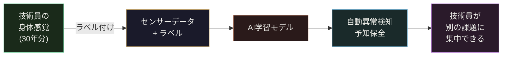

工場で長年旋盤や研削盤を扱ってきた技術員に「主軸が変な音を出してるな、と思ったことはありますか」と聞くと、たいていこんな答えが返ってくる。

「毎日聞いてたらわかるよ。音が少し高くなるんだよね。あるいは振動が変わる感じ。でも言葉にはしにくい」

これは謙遜ではない。本当のことだ。その"変な感じ"は、聴覚・触覚・嗅覚を20年以上鍛えてきた人間の感知システムが検出した、**ほぼ間違いなく有効な信号**だ。

問題は、その信号が個人の身体に記録されていて、共有も転送も継承もできないことにある。

センサーを付けるとどうなるか。ひとことで言えば、**その感覚がデータになる。**

---

## 回転体加工機は何を「喋っている」か

旋盤・マシニングセンタ・研削盤・複合加工機 —— 回転体を加工する機械は、主軸が回り続けている間、膨大な物理情報を放出している。

| 信号の種類 | 発信源 | 主に何を語っているか |
|-----------|--------|---------------------|
| 振動 | 主軸・チャック・心押し | 軸受の状態、アンバランス、ビビリ |
| 電流 | スピンドルモーター | 切削負荷、工具摩耗、軸受の摩擦 |
| 温度 | 主軸端・軸受部・モーター | 熱変位の予兆、潤滑不足 |
| 音（空気音） | 工具接触部・機内全体 | びびり音、工具折損の衝撃 |

これらはすでに存在する。センサーを付けるまで、ただ誰も聞いていなかっただけだ。

---

## センサーごとに「見えること」が変わる

### 振動センサー —— 主軸軸受の"声"を聞く

振動加速度センサー（MEMS型、$300〜1,000程度）を主軸ハウジングに接着固定するだけで、軸受の外輪/内輪/転動体の損傷特性周波数が見えてくる。

軸受損傷が生じると、回転に同期した**衝撃パルス列**が振動信号に乗る。この信号を **エンベロープ解析**（包絡線処理）すると、健全な軸受とは明確に異なるスペクトルが現れる。

もうひとつ重要なのが **ビビリ検出**だ。切削中に発生するチャタリングは加工精度を直撃するが、その周波数成分は主軸回転数の整数倍には現れない。STFT（短時間フーリエ変換）でスペクトルを時系列で追うと、ビビリの発生・消滅がリアルタイムで追跡できる。

```
振動センサー設置の3原則

① センサー位置：主軸軸受の直上、金属面に直付け（磁気ベース可）
② サンプリング：最低 10 kHz 以上（軸受 BPFO 計算には必要）
③ 前処理：DC除去 → バンドパスフィルター → RMS計算（10秒窓）
```

**工具摩耗との関係**も見逃せない。摩耗した工具は健全な工具より振動RMSが大きい傾向があり、摩耗が進むにつれ単調増加する。これを閾値管理すれば、工具折損前の**予防交換タイミング**を客観的に示せる。

---

### 電流センサー —— スピンドルに"聞かずとも分かる"切削の状態

クランプ式の電流センサー（CTセンサー、$50〜200）をスピンドルモーターの動力ケーブルに噛ませるだけ。機械に一切手を加えない、**完全非侵襲**の設置だ。

切削中のスピンドル電流は、工具の切削抵抗を間接的に表す。新品工具と摩耗工具の電流波形を比較すると：

- 新品工具：電流波形はなめらか、高調波成分が少ない
- 摩耗工具：基本波の振幅増大 + 高調波（2f、3f）が顕著に増加
- 工具折損直前：電流が急減（抵抗が消える）→ 折損検出に使える

統計的手法では **CUSUM（累積和管理図）** との組み合わせが有効だ。プロセスの微細な平均シフトを検出し、「いつから変わり始めたか」を特定できる。

軸受劣化にも電流は反応する。**MCSA（Motor Current Signature Analysis）**と呼ばれる手法で、電流スペクトルの特定サイドバンド（$f_s \pm f_{bearing}$）が増加すると軸受劣化のサインになる。振動センサーと電流センサーで**同じ異常を2方向から見られる**ため、誤報が大幅に減る。

---

### 温度センサー —— 熱変位と戦う加工技術者の「見えない敵」

精密加工をやっている人なら知っている。朝イチの機械と、2時間運転後の機械は、同じプログラムで同じ寸法が出ない。これが**熱変位**だ。

主軸軸受部・フロント軸受・モーター端面の3点に熱電対（$5〜30/点）を置くと、主軸の熱伸び量を推定する**熱変位補正モデル**が作れる。

```
補正量 = a₁ × T_front + a₂ × T_rear + a₃ × T_motor + b
```

この回帰式の係数（a₁、a₂、a₃）は、その機械固有のものだ。**その係数を推定するには、機械の熱的挙動を知っている人の経験が必要**になる。「この機械は後ろ軸受より前が早く温まる」という暗黙知を、データが定量化してくれる。

また、軸受温度が通常より急上昇するケースは、潤滑不足・冷却液の濃度異常・過負荷のいずれかを疑うトリガーになる。アラームを出すより**上昇速度（dT/dt）を監視**する方が早期検出できることが多い。

---

### 音響センサー —— 工具折損の0.1秒前に何かがある

空気伝搬音（マイクロフォン、$20〜100）は設置が最も簡単だが、解釈の難易度は高い。加工室内は反響・騒音のるつぼだからだ。

ただし、以下の2つのケースでは音響センサーは非常に効果的だ：

**1. ビビリの早期検知**  
ビビリが始まると、加工音に特定の周波数成分が突如現れる。周波数ドメインで見ると非常に目立つ。振動センサーより反応が速いケースが多い。

**2. 工具折損の衝撃検出**  
工具が折れる瞬間、音響信号に**インパルス状のスパイク**が現れる（持続時間10〜50ms）。単純な閾値越えでも検出できる。折損を検出してスピンドル停止信号を出せれば、加工物や機械のダメージを最小化できる。

---

## データをただ集めても、何も起きない

ここが重要なポイントだ。

センサーからデータが来た。波形が記録された。それで終わりなら、センサーを付けた意味は薄い。AIが「自動的に異常を判定してくれる」と思っている人もいるが、**AIは正解を知らない。教えてもらわないと動かない。**

AIモデルの学習には「ラベル」が必要だ。

> 「この波形が正常」「この波形が軸受劣化初期」「これが工具摩耗末期」

このラベルを正確につけられる人間は誰か。

それは、毎日その機械を見て、音を聞いて、振動を感じてきた人間だ。センサーが出す数値と、自分が感じてきた「変な感じ」を照合して、ラベルをつける作業 —— それが機械学習モデルの訓練データになる。

**30年の経験が、データセットになる瞬間**がここにある。



ラベルをつけた技術員の判断は、AIモデルに変換されて残る。その技術員が異動しても、退職しても、モデルはその判断を再現し続ける。

---

## 現場に置けるデータスキーマ

データを集めるなら、後で使えるフォーマットで残す必要がある。以下は汎用的な設計例だ。

| フィールド名 | 型 | 意味 |
|-------------|-----|------|
| `ts_utc` | ISO 8601 timestamp | 計測時刻（UTC基準） |
| `asset_id` | string | 機械ID（例：`MC-001`） |
| `process_step` | string | 工程名（例：`roughing`, `finishing`） |
| `sensor_type` | enum | `vibration` / `current` / `temp` / `sound` |
| `value` | float | 計測値（RMS、A、℃、dB） |
| `quality_code` | int | 0=正常、1=疑義、2=欠損 |
| `material_lot` | string | 材料ロット番号 |
| `recipe_rev` | string | 加工プログラムバージョン |

`process_step` と `material_lot` を必ず記録する理由がある。

「この波形が異常かどうか」は、**何を加工しているかによって変わる**。難削材の荒削り中の高い電流値は正常だ。同じ電流値が仕上げ加工で出たら異常だ。材料ロットが変われば、同じプログラムでも電流パターンが変わることがある。

コンテキスト無しの平均値と比べるSPC（統計的工程管理）では、この種の偽アラームを避けられない。**工程・材料ロット・プログラムバージョンを揃えた条件内での比較**が、現場で使えるシステムの条件だ。

---

## 3台から始める：最初の投資試算

「大規模IoT化」と聞くと億単位の投資を想像するかもしれないが、回転体加工の主要設備3台に最小構成で乗せるコストは現実的な数字だ。

| 項目 | 内容 | 費用目安 |
|------|------|---------|
| 信号灯センサー（稼働/停止/アラーム） | 3台分 | 6万円 |
| 電流センサー（CTクランプ）| 3台×2軸 | 12万円 |
| 振動センサー（主軸軸受部） | 3台 | 15万円 |
| エッジゲートウェイ | 1台 | 15万円 |
| 設定・配線工事 | 1人・3日 | 15万円 |
| ソフトウェア/クラウド（年間） | 初年度込み | 57万円 |
| **合計初期費用** | | **約120万円** |

これに対して、仮に週1回の計画外停止（2時間/回）が20%削減された場合、年間の機会損失削減は数百万円のオーダーになりうる。工具の折損前交換による工具費削減・加工不良削減も加わる。

投資回収の試算を自社の停止コスト・工具費・不良率で計算してみてほしい。数字は意外と早く回る。

---

## 「自分が言語化できなかったもの」が残る

技術の現場で起きている問題のひとつは、知識の「局在化」だ。

最も腕の立つ技術員の経験は、その人の身体と記憶の中にある。組織の仕組みや文書には入っていない。工程の品質が「あの人がやった仕事かどうか」で変わる —— これが属人化だ。

センサーとデータとラベルの組み合わせは、これを変える可能性がある。

ただし、ラベルをつける人間が不要になるわけではない。むしろ、**ラベルをつける人間がシステムの中核**になる。何が正常で何が異常かを知っている人間、その機械の個性を理解している人間 —— それは最前線の技術員だ。

AIがやっているのは、その判断を大量に記憶して、高速に再現することだ。判断の源泉は人間にある。

センサーを付けてデータを集め、ラベルをつける作業をした技術員は、「自分の知識をシステムに転写した人」になる。そのシステムが工場の中で動き続けることの意味を、少し考えてみてほしい。

---

## Appendix：センサー選定チェックリスト

```
□ 振動センサー
  ├─ 設置場所：主軸フロント軸受ハウジング上面
  ├─ 周波数範囲：10 Hz ～ 10 kHz 以上
  ├─ サンプリング：最低 10 kHz（軸受診断には20 kHz推奨）
  └─ 接続：磁気ベースまたはエポキシ接着

□ 電流センサー（CTクランプ）
  ├─ 設置場所：スピンドルモーター動力線（3相いずれか）
  ├─ レンジ：定格電流の150%まで計測可能なもの
  ├─ 帯域：DC ～ 5 kHz（高次高調波解析用）
  └─ 設置：既設ケーブルへの後付け、無停電作業可

□ 温度センサー（熱電対またはPT100）
  ├─ 設置場所：主軸フロント・リア軸受部（各1点）
  ├─ レンジ：0 ～ 150 ℃
  ├─ 応答速度：30秒以内（熱変位補正用途）
  └─ 設置：既設の測温孔があれば活用

□ 音響センサー（工業用マイク）
  ├─ 設置場所：加工室内、工具接触部から0.5m以内
  ├─ 帯域：100 Hz ～ 20 kHz
  ├─ 耐環境：IP54以上（切削液ミスト対策）
  └─ 補足：ビビリ検出には指向性マイクが有効
```

---

センサーを付けるまで誰も聞いていなかった、主軸の声がある。

それを最初に聞いて、最初にラベルをつける人間が、そのシステムの設計者になる。設備の前に立ってきた時間の長さが、データとモデルの質に直結する唯一のフィールドだ。
