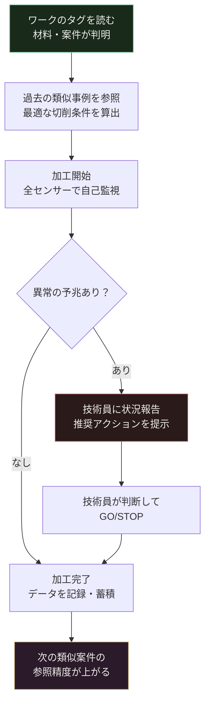

## この記事で分かること

1. 回転体加工機に付けるべき8種のセンサーと、それぞれが「何を教えてくれるか」
2. 集めたデータをAIがどう使うか——具体的な仕組みと精度目標
3. ダッシュボードに何が見えるか——現場での使い方
4. 段階的DXロードマップ——今日から5年後の自律製造まで
5. 一品一様の現場でIoTが機能するための設計上の肝

---

## 前提：一品一様の現場でIoTが難しい本当の理由

大量生産では「1000個の同じ部品の平均値」が正常の基準になる。電流が平均より15%高ければ異常、という判定が成り立つ。

一品一様（毎回異なるワーク・材料・段取り）では、この「平均値」が存在しない。だから「うちの現場にIoTは使えない」という話になりがちだ。

**解決策は「似た条件の過去事例と比べること」だ。**

今回の加工が「ステンレス系・粗加工・プログラムv2.3」なら、比較対象は「同じ材料系・同じ工程・同じプログラムバージョン」の過去事例だけに絞る。その範囲の中で「今回の電流値は正常か異常か」を判定する。

これを実現するために、データに必ず付ける情報（コンテキストタグ）がある：

| タグ | 内容 | なぜ必要か |
|---|---|---|
| 材料系 | SUS系・Ti系・Al系など | 材料が違えば正常な電流値も変わる |
| 工程ステップ | 粗加工・仕上げ・研削など | 工程が違えば正常な振動レベルも変わる |
| プログラム版数 | v2.3など | 切削条件の変更が比較に影響する |
| 案件番号 | P-2026-047など | トレーサビリティと事後分析に使う |

このタグを最初から設計しておくことが、後のAI精度を左右する最重要事項だ。

---

## 8種のセンサー：何を計り、何がわかり、何ができるか

### ① 信号灯センサー——「今、動いているか」を工場全体で見る

**何を計るか：** 赤・黄・緑のランプの点灯状態  
**設置方法：** 既設ランプに光センサーを貼るだけ。改造不要、15分で設置できる  
**コスト目安：** 1台 2〜3万円

**何がわかるか：**
- いつ動いていたか・止まっていたか
- 何回アラームが出たか
- 停止の種類（段取り中 / 機械トラブル / 電源断）

**何ができるか：**  
「体感8割稼働」が実測6割だったという事例は珍しくない。どこで時間が失われているかが初めて数字になる。全ての改善はここから始まる。

---

### ② 電流センサー——「工具の疲労度」を電気から読む

**何を計るか：** スピンドルモーターが使う電流の大きさと波形  
**設置方法：** 動力線にクランプを挟むだけ。機械を止めなくていい、工事不要  
**コスト目安：** 1軸 5,000〜1万円

**何がわかるか：**  
モーターが使う電気の量は切削抵抗に比例する。

| 工具の状態 | 電流の特徴 |
|---|---|
| 新品 | なめらかで安定している |
| 摩耗進行中 | 少しずつ増加していく |
| 摩耗末期 | 増加が加速し、高周波の揺れが増える |
| 折損直前 | 急に下がる（工具が素材に当たらなくなるため） |

軸受が劣化すると、電流の波形の中に「軸受の回転に同期した細かい揺れ」が現れる。これは振動センサーと独立した検知経路になるため、**2つのセンサーが同じ異常を別々に検知することで、誤報を大幅に減らせる。**

**AIの使い方：**  
「過去の類似事例と比べたとき、この電流の増え方は速すぎるか」を自動判定する。単純な上限値管理ではなく、緩やかな変化を早期に捉えることが目的だ。

**何ができるか：**  
工具が折れる前に交換タイミングを知る。折損による加工不良と、加工物・機械へのダメージを防ぐ。

---

### ③ 重量センサー——「材料の確認」と「削り量の記録」

**何を計るか：** 加工前後のワーク重量  
**設置方法：** ワーク置き台の下に組み込む  
**コスト目安：** 5,000〜3万円

**何がわかるか：**  
加工前後の重量差＝削り取った量。材料ロットごとの切削量のばらつきも記録できる。

**一品一様での特別な価値：**  
段取り時に重量を計れば「この材料、図面指定のスペックか」を確認できる。材料の取り違えは重量が最も早く検知する。

---

### ④ 振動センサー——「主軸の健康状態」を毎日診断する

**何を計るか：** 主軸軸受付近の振動加速度（揺れの強さと周波数）  
**設置方法：** 主軸ハウジングに貼り付け（磁石固定可）  
**コスト目安：** 1台 4〜10万円

**何がわかるか：**

| 異常の種類 | 振動信号の変化 | 意味 |
|---|---|---|
| 軸受の傷 | 特定の周波数でパルスが繰り返す | 傷が転動体に当たるたびに衝撃が出る |
| 工具のビビリ | 加工中に非整数倍の周波数が突現 | 加工面が波打ち始めているサイン |
| アンバランス | 回転数に比例した振動が増大 | チャッキングや工具取り付けの偏りを示す |
| 工具摩耗 | 振動全体の大きさが緩やかに増加 | 摩耗が進むほど切削が不安定になる |

**AIの使い方：**  
健全な状態の振動パターンを学習し、そこからの逸脱を検知する。「先週と比べてどう変わったか」を自動で追跡するため、緩やかな劣化を見落とさない。

**何ができるか：**  
軸受が壊れる**2週間前**に異常を検知できることを目標とする（検知率70%以上）。計画的な交換が可能になり、突発停止を防げる。

---

### ⑤ 音響センサー——「異常音」をデータとして記録する

**何を計るか：** 加工室内の音（空気振動）  
**設置方法：** 加工室内に防水マイクを設置  
**コスト目安：** 5,000〜3万円

**2つの使い方：**

**工具折損の即時検知：**  
工具が折れる瞬間、音響信号に0.1秒以下の鋭いスパイクが出る。これを検知して主軸を即停止させると、折れた工具が加工面をさらに傷つけるのを防げる。72時間加工の71時間目でも、ここで止めれば補修できる可能性が残る。

**ビビリの早期警告：**  
ビビリが始まると加工音の中に特定の周波数が混じる。振動センサーより速く反応することが多く、気づいた時点で送り速度を落とせれば加工面を救える。

---

### ⑥ 温度センサー——「熱変位」を補正して精度を安定させる

**何を計るか：** 主軸の3点温度（前軸受・後軸受・モーター端）  
**設置方法：** 熱電対を3点に貼り付け  
**コスト目安：** 3点で 1〜3万円

**「熱変位」とは何か：**  
主軸が温まると金属が膨張し、刃先の位置が変わる。数ミクロン〜数十ミクロンのずれだが、精密加工では寸法不良の原因になる。これが「朝イチと2時間後の機械で同じプログラムでも同じ寸法が出ない」理由だ。

**AIの使い方：**  
3点の温度データから刃先のずれ量を計算し、自動補正する。

```
補正量 = （前軸受温度 × A）+（後軸受温度 × B）+ 基準値
```

係数AとBは機械ごとに異なる。その係数を求めるには、機械の熱特性を観察したデータが必要だ——ここに現場の知識が使われる。

**何ができるか：**  
補正後の寸法誤差を±2μm以内に抑えることを目標とする。暖機待ち時間の短縮にもつながる。

---

### ⑦ 位置・RFIDセンサー——「今、何がどこにあるか」を自動で把握する

**何を計るか：** ワーク・工具の位置と通過履歴  
**設置方法：** ワーク/工具にタグを貼り、工程入口に読取機を置く  
**コスト目安：** タグ1枚500〜2,000円、読取機1台3〜10万円

**一品一様での価値：**

- **段取りミスの防止：** 「このワークにはこのプログラム」の紐付けをタグで管理。間違ったプログラムを呼び出した瞬間に警告が出る
- **工具使用時間の自動記録：** どの工具を何時間使ったかが追跡できる
- **棚卸しの自動化：** 工具棚卸しが、システムを見るだけで完了する（工数50%削減が目標）

---

### ⑧ 画像センサー——「目視確認」を自動化する

**何を計るか：** 加工面の状態・工具刃先の摩耗量  
**設置方法：** 加工完了ポジションにカメラとリングライトを固定  
**コスト目安：** 1セット 20〜80万円

**AIの使い方：**  
「良い面」「悪い面」と技術員が判断した加工面の写真を数百枚学習させる。以後、AIが同じ判断を自動で行う。

**重要な前提：**  
「良い・悪いを決める目利き」は人間がやる。AIはその判断を速く大量に再現するだけだ。学習データの質が、AIの精度を決める。

**何ができるか：**  
外観検査の自動化率95%以上・見落とし率2%以下を目標とする。電流・振動データと組み合わせることで、工具寿命予測の精度も上がる。

---

## ダッシュボードで何が見えるか

センサーのデータは、以下の3つの画面で管理する。

**画面①：工場全体の今の状態**

```
┌─────────────────────────────────────────────────────┐
│  全設備ステータス              2026-05-13  08:24    │
├──────────┬──────────┬──────────┬──────────┬─────────┤
│  機械 A  │  機械 B  │  機械 C  │  機械 D  │  機械 E │
│ ● 稼働中 │ ● 稼働中 │ ⚠ 要確認 │ ○ 停止中 │ ● 稼働中│
│  電流:正常│  電流:正常│  振動:↑  │  段取中  │  電流:正常│
│  稼働率  │  稼働率  │  稼働率  │  稼働率  │  稼働率 │
│   78%   │   85%   │   71%   │    0%   │   82%  │
└──────────┴──────────┴──────────┴──────────┴─────────┘
```

機械を選択すると、その機械の電流・振動・温度のグラフが表示される。グラフには「過去の類似事例から算出した正常範囲」が帯として重なっており、現在値がその帯を外れ始めたとき視覚的に判断できる。

**画面②：工具の状態一覧**

| 工具 | 累積使用時間 | 推定残寿命 | 状態 |
|---|---|---|---|
| 超硬チップ #412 | 18.4時間 | 約 6.6時間 | ⚠ 交換推奨 |
| ドリル φ12 #523 | 8.1時間 | 約 16.9時間 | ✅ 正常 |
| エンドミル #318 | 23.2時間 | 約 1.8時間 | 🔴 要交換 |

推定残寿命は、電流・振動の変化パターンと過去の同種工具の実績から算出する。精度目標は残寿命の誤差±15%以内だ。

**画面③：今日・今週の実績サマリー**

稼働率、停止回数・理由、工具交換回数、アラート件数、対応済み件数——この数字を毎日記録することで、「月単位での改善が数値で見える」ようになる。

---

## AIは何をしているか——難しく言わない

この記事で「AI」と書いているものは、実態は**「過去のデータから学習したパターン判定システム」**だ。

3つのことをやっている：

**1. 異常を見つける**  
「コンテキストが似た過去事例の正常範囲」と現在値を比べて、外れていたら通知する。人間でいえば「何か変だな」と気づく作業を自動でやっている。

**2. 先を読む**  
電流・振動・温度の変化パターンから「このままいくとあと何時間で工具が摩耗末期になるか」を推定する。過去の工具交換記録（いつ・どんな状態で交換したか）が蓄積されるほど、この推定が正確になる。

**3. 学習し続ける**  
技術員が「この状態で工具を交換した」「この音が出たときはビビリだった」という記録を付けるたびに、判定の精度が上がる。使えば使うほど賢くなる。

初日から高精度な予測ができるわけではない。半年でざっと使えるレベルになり、1年で予測が信頼できるレベルになる。

---

## DXロードマップ：5段階で自律製造へ


### 第1段階：データを集める（〜3か月）

**やること：** 信号灯＋電流センサーを既存設備に設置。データを記録し始める  
**初期費用目安：** 3台で約 33万円（センサー＋設置工事）＋ソフトウェア  
**この段階でわかること：** 稼働率の実態・停止回数と理由・電流の基礎データ

> まずここから始める。ここを飛ばして先に進もうとすると、比較するデータがないためAIが機能しない。

---

### 第2段階：異常を知らせる（〜6か月）

**やること：** 振動・温度・音響センサーを追加。「正常範囲を外れたら通知」の設定  
**この段階でできること：**
- 工具摩耗の進行をグラフで追える
- 軸受の状態変化を数値で確認できる
- スマートフォンに通知が来る

**変わること：** 「壊れてから対応する」から「変化に気づいて対応する」に変わる  
**定量効果目標：** 計画外停止 20〜40%削減・工具折損 50%以上削減

---

### 第3段階：先を読む（〜1年）

**やること：** 重量・RFIDセンサーを追加。工具寿命予測モデルの学習を開始  
**この段階でできること：**
- 「あと何時間で工具を交換すべきか」がわかる
- 材料ロットの違いによる加工条件のばらつきを記録できる
- 熱変位の自動補正が始まる（精度の安定化）

**変わること：** 保全計画を「経験と感覚」から「データと予測」で立てられる  
**定量効果目標：** 工具寿命予測誤差 ±15%以内・熱変位補正後誤差 ±2μm以内

---

### 第4段階：最適化を提案する（〜3年）

**やること：** 画像センサーを追加。切削条件の最適提案機能を実装  
**この段階でできること：**
- 外観検査が自動化される（95%以上の検査を機械が担当）
- 「この材料・この工程にはこの切削条件が最適」を過去事例から提案
- 新設備の調達基準が変わる（「センサーポート付き・通信対応」が必須条件に）

**変わること：** 技術員の判断を「支援するシステム」から「提案するシステム」へ

---

### 第5段階：機械が自律する（〜5年）

この段階では、機械が以下の流れを自律的に実行する。



**一品一様の自律製造とは：**  
毎回異なるワークに対して、機械が「今回に最も近い過去事例」を参照して最適な加工条件を自動設定し、加工中は自分で監視し、異常の予兆があれば技術員に判断を求める——このサイクルだ。

**技術員の役割は変わらない。変わるのは使う時間の配分だ：**

| 作業 | 現在 | 第5段階 |
|---|---|---|
| 加工中の監視（音・電流・振動） | 常時注意が必要 | センサーが担当 |
| 工具交換タイミングの判断 | 経験と勘 | システムが提案・技術員が承認 |
| 棚卸し・工具管理 | 手作業 | 自動追跡 |
| 難しい段取りの判断 | **技術員が担当** | **引き続き技術員が担当** |
| 異常時の対処判断 | **技術員が担当** | **引き続き技術員が担当** |
| 新しい加工へのチャレンジ | 時間が足りない | **時間が生まれる** |

---

## 投資効果：数字で確認する

### 初期費用（既存設備3台・第1〜3段階のセンサー）

| 項目 | 費用目安 |
|---|---|
| センサー類（信号灯・電流・振動・温度・音響） | 約 33万円 |
| エッジゲートウェイ（データ集約機器） | 約 15万円 |
| 設置・配線工事（3日） | 約 15万円 |
| ソフトウェア・クラウド（初年度） | 約 57万円 |
| **合計初期費用** | **約 120万円** |

### 年間効果の目安

| 効果項目 | 年間効果額の目安 |
|---|---|
| 計画外停止の削減（20〜40%削減） | 80〜160万円 |
| 工具折損・加工不良の削減 | 40〜80万円 |
| 棚卸し・点検工数の削減 | 20〜40万円 |
| **合計** | **140〜280万円** |

**投資回収期間：5〜10か月**

一品一様の大型ワーク（加工時間60時間超）が工程途中で全損したときのコストを考えると、センサー全体の初期投資は「1件の全損を防ぐだけで回収できる水準」にある。

---

## 今すぐ始めるためのチェックリスト

```
【第1段階を始める前に確認すること】

□ データに付けるタグを決める
    材料系・工程名・プログラム版数・案件番号
    ※ あとから変えると過去データとの整合が崩れる。最初に決める

□ 信号灯センサーを1台設置する（今週できる）
    コスト 2〜3万円、設置 1時間

□ 電流センサーをスピンドル動力線に取り付ける
    コスト 1軸 5,000〜1万円、工事不要・無停電作業可

【第2段階に進む前に確認すること】

□ 1か月分のデータが蓄積されているか
□ 稼働率・停止原因のグラフが正確に出ているか
□ 振動センサーの設置位置を決定する（主軸フロント軸受付近）
□ アラート通知先と対応フローを決める

【第3段階に進む前に確認すること】

□ 各センサーのデータが 100件以上蓄積されているか
□ 技術員によるラベル記録が習慣化されているか
    「この状態で工具を交換した」という記録が蓄積するほど予測精度が上がる
□ 工具交換履歴とデータが紐付いているか
```

---

センサーは機械に「声」を与える。ダッシュボードはその声を「見える形」にする。AIはその声の意味を「解釈して伝える」。そして技術員が「判断する」。

第1段階の信号灯1台が、5年後の自律製造の起点になる。最初のデータスキーマ（タグの設計）だけは、慎重に決めてほしい。
