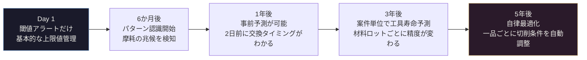
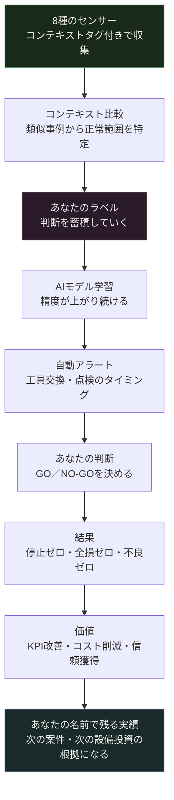

まず、2つの正直な問いに答えることから始める。

**「センサーを付けて結果が出たとき、それは自分の手柄になるのか」**

**「このシステムは本当に使い続けられるのか、意味があり続けるのか」**

IoTの話をすると、技術員が一番気にするのはここだ。技術の話ではない。「自分にとって意味があるか」という話だ。

答えを先に言う。

**なる。そして、使えば使うほど価値が増す。** ただし、その理由を正確に理解しないと、この2つは実現しない。

---

## なぜ「自分の手柄」になるのか

センサーはデータを集める。でもデータは、それだけでは何も語らない。

「この電流パターンが出たとき、何が起きていたか」——この問いに答えられるのは、その機械の前に立ってきた人間だけだ。

**ラベルを付ける作業がある。**

```
電流がこのパターンで増加 → 確認したら工具摩耗末期だった → 交換した → その後の加工は正常
振動がこの値を超えた → 前日の加工でびびり痕が出ていた → 送り速度を落とした → 解消
温度の上昇速度がいつもより速い → 冷却液の濃度を確認したら薄くなっていた → 補正した
```

このラベルを100回、200回積み上げていくと、AIモデルはそのパターンを覚える。次から「このパターンは要注意」を自動で検知するようになる。

ここで重要なことがある。

**そのモデルには、あなたのラベルが刻まれている。**

データには付けた人の名前と時刻が残る。どの判断が、どのラベルが、モデルの精度を支えているかは、後から追跡できる。3年後に誰かが「なぜこのシステムはこんなに正確に工具摩耗を検知できるのか」と聞いたとき、答えは「○○さんが最初の2年間で積み上げた250件のラベルデータ」になる。

システムが優秀なのではない。**システムに精度を与えた人が優秀なのだ。**

センサーが工具折損を未然に防いだとき、それは誰の手柄か。

- センサーは信号を拾った
- AIはパターンを認識した
- でもそのパターンを「これは危険」と最初に判断したのは、ラベルを付けたあなただ
- その判断が、今日も、明日も、あなたが現場にいなくても、動き続ける

これを「システムの手柄」と呼ぶ人はいない。

---

## なぜ「使えば使うほど価値が増す」のか

工具は使えば摩耗する。機械は使えば劣化する。知識は使わなければ風化する。

このシステムは違う。**使えば使うほど賢くなる。**



Day1に閾値アラートしかできなかったシステムが、3年後には「このSUS316L、このロット番号の材料は他のロットより硬い傾向があるため、工具寿命が15%短くなる」という予測ができるようになる。

これは、3年分のラベルデータが蓄積されたからだ。

**あなたが今年付けたラベルが、3年後のシステムの精度を作っている。**

今日の作業が、3年後の価値に変わる。これは通常の仕事では滅多にない話だ。今日溶接した部品は、出荷されれば終わりだ。でも今日付けたラベルは、明日も来年も再来年も、現場で働き続ける。

**あなたの貢献の「重さ」は、時間とともに増える。**

---

## 一品一様だから難しい、という思い込みを解く

「毎回ワークが違う現場で、どうやって正常値を決めるんだ」——これは正しい疑問だ。

大量生産向けのIoTは1000個の平均から正常値を作る。一品一様にはその平均がない。だから「一品一様にIoTは使えない」という話が生まれた。

**半分だけ正しい。残り半分は間違いだ。**

鍵は「コンテキスト比較」だ。全ての過去事例の平均と比べるのをやめる。代わりに、**今回の仕事に条件が似た過去事例だけを選んで比べる。**

今回が「SUS316L・粗加工・スピンドル800rpm・送り0.25mm/rev」なら、比較対象は「SUS系難削材・粗加工工程・同程度の切削条件」の過去事例に絞る。その中で今回の電流値や振動が正常範囲かを判定する。

| タグ | 意味 | 例 |
|---|---|---|
| `material_lot` | 今回の材料ロット | SUS316L-B3 |
| `process_step` | 今どの工程か | `rough_turning` |
| `recipe_rev` | プログラムのバージョン | v2.3 |
| `project_id` | 案件番号 | P-2026-047 |

このタグが揃えば、「一品一様の現場でも、似た仕事の中での異常」を検知できる。ラベルを付けるとき、このタグも一緒に記録することが、精度の源泉になる。

一品一様こそ、コンテキストが豊富だ。素材・形状・工程・担当者が毎回違う——その「違い」の情報を全部タグにすれば、比較の精度が上がる。大量生産より一品一様の方が、実はコンテキストが豊かなのだ。

---

## 機械が使っている8つの言語

センサーは機械の「言語」を翻訳する道具だ。回転体加工機は、8種類の言語で喋り続けている。

### 言語①：信号灯の色

赤・黄・緑のランプに光センサーを貼る。改造なし、15分で設置できる。

「今、動いているか・止まっているか」が記録される。「体感8割稼働」が実測6割だった、という現場は少なくない。その2割がどこで失われているかが初めて見える。これが全ての出発点だ。

### 言語②：電流

スピンドルモーターの動力線にクランプ式センサーを挟む。工事不要。

新品工具は電流がなめらかだ。摩耗した工具は少しずつ電気を多く食う。折損直前には電流が急に落ちる（工具が素材に当たらなくなるから）。この変化を、コンテキスト比較で過去の類似事例と照らし合わせれば、「今回の摩耗進行は早い」が分かる。

### 言語③：重量

加工前後にワークを計る。削った量が数字になる。

一品一様では「この材料、本当に指定のスペックか」という確認が重要だ。材料の取り違えは重量が一番早く気づく。段取り時の確認が自動化できる。

### 言語④：振動

主軸の軸受近くに加速度センサーを貼る。軸受が傷むと揺れ方のパターンが変わる。ビビリが始まると特定の周波数が突然現れる。工具の摩耗が進むと振動の大きさが増す。これらは全て、過去の類似事例と比べることで「異常かどうか」が分かる。

### 言語⑤：音

加工室にマイクを置く。工具が折れる瞬間、音響信号に0.1秒以下の鋭いスパイクが出る。これを検知してスピンドルを止めれば、折れた工具が加工面をさらに傷つけることを防げる。ビビリが始まる音も、振動センサーより速く反応することがある。

### 言語⑥：温度

精密加工をやってきた人は知っている。**朝イチの機械と2時間後の機械では、同じプログラムで同じ寸法が出ない。** 熱変位だ。主軸の3点に温度センサーを貼れば、その変位量を予測して補正できる。「前が先に温まる、後ろが遅れて上がる」——その機械の個性を知っている人間が係数を決める。データが観察を数式にする。

### 言語⑦：位置・RFID

ワークと工具にRFIDタグを付ける。「今、どのワークがどの工程にいるか」「この工具は合計何時間使ったか」が自動で追跡できる。一品一様で最も怖い段取りミスを、プログラム呼び出し時の照合で防げる。工具棚卸しが、システムを見るだけで完了する。

### 言語⑧：画像

加工完了ポジションにカメラを置く。バリ・キズ・工具刃先の摩耗状態を自動で確認する。**目利きは人間、全数チェックは機械。** 電流・振動データと組み合わせれば、工具寿命の予測精度が大幅に上がる。

---

## センサーから結果まで、一本の道



フローの中に2か所、「あなた」が登場する。

ひとつ目は**ラベル付け**。ここで蓄積したあなたの判断が、モデルの精度を作る。

ふたつ目は**最終判断**。システムが「要注意」を出したとき、加工を続けるか・止めるか・工具を交換するかを決めるのはあなただ。センサーは「今、こういう状態です」と事実を伝える。判断はあなたがする。

この2点が、「あなたの手柄」を構造的に保証している。

---

## 数字で見る：3台の既存設備に乗せたとき

| 項目 | 費用 |
|---|---|
| 信号灯センサー（3台） | 約 6万円 |
| 電流センサー（3台×2軸） | 約 12万円 |
| 振動センサー（3台） | 約 15万円 |
| エッジゲートウェイ（1台） | 約 15万円 |
| 設置・配線工事（3日） | 約 15万円 |
| ソフトウェア・クラウド（初年度） | 約 57万円 |
| **合計初期費用** | **約 120万円** |

一品一様の現場で大型ワークが加工途中で全損したときのコスト——材料費・加工時間・段取り費・納期対応・信用損失——1件で数百万円を超えることがある。

**1件の全損を防げれば、初期投資は回収できる。**

それ以外の効果として、計画外停止20〜40%削減（年間80〜160万円相当）、工具折損・不良削減（年間40〜80万円相当）、棚卸し・点検工数削減（年間20〜40万円相当）。投資回収は5〜10か月が目安だ。

---

## 1年後・3年後・5年後に何が起きるか

### 1年後：「なぜ止まったか」が全部説明できるようになる

停止の原因、工具交換のタイミング、電流の変化——全てがログに残る。「先月の生産効率が落ちた理由」を感覚ではなくデータで説明できる。その説明をできる人間が、現場で一番信頼される人間になる。

### 3年後：新しい設備は「最初からつながって生まれてくる」

3年のデータが蓄積されると、設備投資の判断基準が変わる。「次の機械はOPC UA対応か」「センサーポートはあるか」が購入条件に入る。新設備は設置した瞬間からデータが流れ始め、古い設備は後付けセンサーでつなぎ直される。工場が少しずつオンラインになっていく。

そのとき、**3年間データを育ててきた人間が、新設備の立ち上げの中心にいる。**

### 5年後：機械が「一品ごとに自分で判断する」

ワークのRFIDを読んだ瞬間に、機械が「この材料・この工程・この案件の過去類似事例」を参照して最適な切削条件を提案する。加工中は自己監視して、異常の予兆があればあなたに判断を求める。あなたがGOを出す。加工完了後、そのデータが次の類似案件の参照事例として蓄積される。

これが一品一様の自律製造だ。完全に自動ではない。機械が監視・提案して、人間が判断する。そのサイクルが回るたびに精度が上がる。

**5年後のシステムの精度は、今年あなたが付けたラベルの質で決まる。**

---

## AIには絶対にできないこと

率直に言う。この話を聞いて「自分の仕事がなくなるのでは」と思った人もいるかもしれない。

答えを言う。

AIは図面を見てワークの持ち方を考えられない。AIは材料が図面スペックより硬いと感じ取れない。AIは「このお客さんはここを特に気にする」という文脈を読めない。AIは未知の形状に対して「こういうアプローチはどうだ」と発想できない。

一品一様の仕事が今もあなたの現場に来るのは、**それが難しいから**だ。難しいから自動化されていない。難しいからあなたが必要とされている。

センサーが引き受けるのは監視だ。今まで耳を澄ませて音を聞き、手で振動を感じ、目で電流計を確認していた、その**監視という作業**を引き受ける。

その分の集中力が、難しい仕事の判断に向かう。

**監視はセンサーに渡す。判断はあなたが持ち続ける。**

---

## 今週できること

大規模なプロジェクトは必要ない。

**今週できることは、信号灯に光センサーを1台付けることだ。**

設置1時間、コスト2〜3万円。付けた翌日から「この機械は先週何時間動いていたか」がわかる。

それだけで何かが変わる。「8割稼働のはずが6割だった」という事実を見た瞬間から、次の問いが生まれる。「残りの2割はどこで失われているのか」。その問いがセンサーを増やす理由になる。

そして6か月後、1年後、3年後——**使えば使うほど賢くなるシステム**が、あなたのラベルで動き続ける。

---

## 付録：3フェーズ設置チェックリスト

```
【第1フェーズ：今すぐ〜3か月】

□ 信号灯センサー
  設置：既設ランプに光センサーを貼付（改造なし）
  記録：緑（稼働）黄（段取/準備）赤（アラーム）消灯（停止）
  活用：稼働率・停止時間・停止理由の自動記録

□ 電流センサー（CTクランプ型）
  設置：スピンドル動力線にクランプ（無停電作業可）
  性能：定格電流の1.5倍計測可・帯域DC〜5kHz
  活用：工具摩耗監視・折損検知・切削負荷のコンテキスト記録

【第2フェーズ：6か月〜1年後】

□ 振動センサー（加速度センサー）
  設置：主軸フロント軸受ハウジング上面・金属面直付け
  性能：周波数10Hz〜10kHz以上・サンプリング10kHz以上
  活用：軸受診断・ビビリ検出・工具摩耗進行度

□ 温度センサー（熱電対）
  設置：主軸フロント軸受・リア軸受・モーター端面の3点
  性能：0〜150℃・応答30秒以内
  活用：熱変位補正・軸受過熱早期検知（上限値だけでなく上昇速度も監視）

□ 音響センサー（工業用マイク IP54以上）
  設置：加工室内・工具接触部から0.5m以内
  性能：100Hz〜20kHz・指向性推奨
  活用：工具折損即時検知・ビビリ早期警報

□ 重量センサー（ロードセル）
  設置：ワーク置き台下部
  活用：材料確認・加工量管理・段取りミス防止

【第3フェーズ：1〜2年後】

□ 位置・RFIDセンサー
  設置：タグをワーク・工具ホルダーに貼付（耐熱・耐油仕様）
  活用：工程追跡・工具使用時間管理・段取りミス防止・棚卸自動化

□ 画像センサー（工業用カメラ＋リングライト）
  設置：加工完了ポジションに固定マウント
  活用：外観自動検査・工具刃先摩耗計測・AI学習による判定自動化
```

---

センサーはデータを集める。

でもそのデータに意味を与えるのは、判断を持っている人間だ。

**3年後のこのシステムは、今年あなたが付けたラベルで動いている。** その実績は、あなたの名前で残る。
