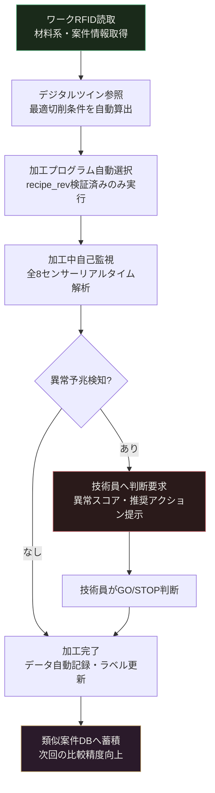

## 1. 技術的前提：なぜ一品一様でIoTが難しいのか

大量生産向けIoTは、n個の同一部品のデータから統計的基準値（μ±3σ）を算出し、そこからの逸脱を異常とみなす。一品一様（ETO：Engineer-to-Order）加工では、同一条件の繰り返しがないため、この手法は直接適用できない。

**解決策はコンテキスト比較（Context-Aware Anomaly Detection）だ。**

全事例の平均と比較するのではなく、**今回の加工コンテキストに一致する過去事例のみを比較対象**とする。コンテキストは以下のフィールドで定義する：

```json
{
  "ts_utc":       "2026-05-13T08:23:11Z",
  "asset_id":     "MC-003",
  "project_id":   "P-2026-047",
  "process_step": "rough_turning",
  "material_lot": "SUS316L-B3",
  "recipe_rev":   "v2.3",
  "sensor_type":  "current_rms",
  "value":        18.4,
  "quality_code": 0,
  "retention_class": "hot"
}
```

`process_step`・`material_lot`・`recipe_rev` の3フィールドが揃えば、一品一様でも「同条件の過去n件」を抽出できる。その分布の中で現在値の位置を評価するのがコンテキスト比較の核心だ。

---

## 2. システムアーキテクチャ

```mermaid
flowchart TD
    subgraph EDGE["エッジ層（機械設置場所）"]
        S1["信号灯センサー"] & S2["電流センサー"] & S3["重量センサー"] & S4["振動センサー"] & S5["音響センサー"] & S6["温度センサー"] & S7["RFID読取機"] & S8["画像カメラ"]
        --> GW["エッジゲートウェイ\nMQTT Broker\n前処理・フィルタリング"]
    end
    subgraph CLOUD["クラウド/オンプレ層"]
        GW --> TSDB["時系列DB\n（InfluxDB / TimescaleDB）"]
        TSDB --> AI["AIエンジン\n異常検知・寿命予測"]
        TSDB --> DASH["見える化\nダッシュボード"]
        AI --> ALERT["アラート・通知\n（スマートフォン連携）"]
        AI --> MAINT["保全計画\n自動スケジューリング"]
    end
    subgraph MES["上位システム連携"]
        MAINT --> ERP["ERP / 生産管理"]
        AI --> DT["デジタルツイン\n（一品一様モデル）"]
    end
    style EDGE fill:#0d1a0d,stroke:#6ec897
    style CLOUD fill:#0d0d1a,stroke:#6e97c8
    style MES fill:#1a0d1a,stroke:#c8a96e
```



MQTTトピック構造：

```
factory/{site}/{area}/{asset}/telemetry/{sensor_type}
例: factory/plant1/machining/MC-003/telemetry/current_rms
```

エッジゲートウェイ上で行う前処理：
- 電流/振動：RMS計算（10秒窓）・外れ値除去（3σクリッピング）
- 振動：FFT→周波数帯域別RMS抽出
- 温度：移動平均（60秒窓）・dT/dt（上昇速度）算出
- 画像：ROIクロップ・輝度正規化

---

## 3. センサー別技術仕様・適用AI手法・KPI

| センサー | 主な測定対象 | 適用AI手法 | 検出対象 | KPI目標 |
|---|---|---|---|---|
| **信号灯** | 稼働状態（3色） | ルールベース分類 | 稼働/停止/アラーム | 稼働率可視化・停止記録100% |
| **電流** | スピンドル電流RMS | CUSUM・高調波解析・MCSA | 工具摩耗・折損・軸受劣化 | 工具折損検知率 >85%・誤報率 <10% |
| **重量** | ワーク重量差分 | 統計的閾値管理（±3σ） | 材料取り違え・切削量偏差 | 段取りミス検知率 100% |
| **振動** | 主軸振動加速度 | エンベロープ解析・STFT・1X成分抽出 | 軸受損傷・ビビリ・アンバランス | 軸受異常早期検知率 >70%（破損の2週間前） |
| **音響** | 加工音圧レベル | スペクトル差分・インパルス検出 | 工具折損衝撃・ビビリ発生 | 折損衝撃検知遅延 <0.1秒 |
| **温度** | 主軸3点温度 | 重回帰・物理モデル（熱変位補正） | 熱変位量・軸受過熱・潤滑不足 | 熱変位補正誤差 <±2μm |
| **RFID** | ワーク/工具位置 | 決定論的トレース | 工程通過履歴・工具使用時間 | 棚卸工数 50%削減・誤投入0件 |
| **画像** | 加工面・工具刃先 | CNN（ResNet転移学習）・画像差分 | 外観不良・刃先摩耗量 | 外観検査自動化率 >95%・見落とし率 <2% |

### 電流センサーのAI手法詳細

**CUSUM（累積和管理図）：**
プロセス平均の微小シフトを検出する手法。通常のSPC管理図では見逃す0.5〜1.5σ程度の漸進的変化を捉える。工具摩耗は電流の緩やかな増加として現れるため、CUSUMは特に有効だ。

```
累積和 C_t = max(0, C_{t-1} + (x_t - μ_0 - k))
アラート条件: C_t > h  （h：判定閾値）
```

**MCSA（Motor Current Signature Analysis）：**
電流スペクトルの特定周波数（回転数と軸受損傷周波数の和差成分：f_s ± f_bearing）の振幅増加を検知することで、軸受劣化を振動センサーと独立した経路で確認できる。2つのセンサーが同じ異常を独立に検知することで、誤報率を大幅に低減できる。

### 振動センサーのAI手法詳細

**エンベロープ解析（Envelope Analysis）：**
軸受損傷による衝撃パルス列を検出する手法。バンドパスフィルターで共振帯域を抽出→整流→低域通過フィルターで包絡線を取得→FFTで軸受損傷特性周波数（BPFO/BPFI/BSF）を確認する。

**STFT（短時間フーリエ変換）：**
加工中のビビリ検出に使用。ビビリ周波数は主軸回転数の整数倍には現れないため、スペクトルの非調波成分の突現をリアルタイムで監視する。

---

## 4. 見える化：ダッシュボード設計

ダッシュボードは3層で構成する。

### Layer 1：リアルタイム状態パネル

全機械の現在状態を一画面に集約する。

```
┌─────────────────────────────────────────────────────┐
│  MACHINING CENTER STATUS          2026-05-13 08:24  │
├──────────┬──────────┬──────────┬──────────┬─────────┤
│  MC-001  │  MC-002  │  MC-003  │  MC-004  │  MC-005 │
│  ● 稼働  │  ● 稼働  │  ⚠ 要注意 │  ○ 停止  │  ● 稼働 │
│  電流 正常│  電流 正常│  振動↑   │  段取中  │  電流 正常│
│  稼働率   │  稼働率  │  稼働率  │  稼働率  │  稼働率 │
│   78%    │   85%   │   71%   │    0%   │   82%  │
└──────────┴──────────┴──────────┴──────────┴─────────┘
```

### Layer 2：トレンドグラフ（機械別）

選択した機械の時系列データを表示する。

- **電流RMSトレンド**：コンテキスト比較の正常範囲帯（過去類似事例のμ±2σ）を重ねて表示。現在値が帯域を外れ始めたとき視覚的に判定できる。
- **振動RMSトレンド**：周波数帯域別（10-1kHz, 1-5kHz, 5-10kHz）に分けて表示。どの帯域が変化しているかで異常の種類を推定できる。
- **主軸温度トレンド**：フロント/リア軸受/モーターの3点同時表示。上昇速度（dT/dt）を別グラフで可視化。

### Layer 3：保全・工具管理パネル

| 工具ID | 工具種類 | 累積使用時間 | 推定残寿命 | 前回交換日 | ステータス |
|---|---|---|---|---|---|
| T-0412 | 超硬チップ | 18.4h | 約6.6h | 2026-05-10 | ⚠ 交換推奨 |
| T-0523 | ドリル φ12 | 8.1h | 約16.9h | 2026-05-11 | ✅ 正常 |
| T-0318 | エンドミル | 23.2h | 約1.8h | 2026-05-08 | 🔴 要交換 |

推定残寿命は電流高調波成分と振動RMSの複合特徴量から回帰モデル（XGBoostまたはLSTM）で算出する。コンテキスト（材料系・工程）別にモデルを分けることで、一品一様の条件変動に対応する。

---

## 5. AI活用の具体的手法と精度目標

### 異常検知モデル

| 対象 | 手法 | 特徴 | 適用フェーズ |
|---|---|---|---|
| 軸受劣化 | LSTM Autoencoder | 正常パターンを学習し、再構成誤差で異常度を算出 | フェーズ3以降 |
| 工具摩耗 | Isolation Forest | ラベルなし異常検知。初期導入時に有効 | フェーズ2から |
| ビビリ検出 | スペクトル差分＋閾値 | シンプルかつ高速。リアルタイム検知に適す | フェーズ2から |
| 工具折損 | インパルス閾値検出 | 音響・電流の急変を単純閾値で即時検知 | フェーズ1から |

### 予測モデル

| 対象 | 手法 | 入力特徴量 | 精度目標 |
|---|---|---|---|
| 工具寿命予測 | XGBoost / LSTM | 電流RMS・振動RMS・累積使用時間・材料系・工程 | 残寿命予測誤差 ±15%以内 |
| 熱変位補正 | 重回帰（物理制約付き） | 3点温度・回転数・時間経過 | 補正後誤差 <±2μm |
| 軸受余寿命推定 | PHM（Prognostics and Health Management） | 振動エンベロープRMS・MCSA特徴量 | 故障14日前検知率 >70% |

### コンテキスト比較の実装

```python
# コンテキストマッチングによる正常範囲算出（概念コード）

def get_context_baseline(current_context, history_db, min_samples=10):
    """
    現在のコンテキストに一致する過去事例を抽出し、
    正常範囲（μ, σ）を返す
    """
    matched = history_db.query(
        process_step  = current_context["process_step"],
        material_type = current_context["material_type"],  # lot単位ではなく材種で緩和マッチ
        recipe_rev    = current_context["recipe_rev"],
        min_quality   = "normal"   # 正常ラベル付きのみ
    )
    
    if len(matched) < min_samples:
        # サンプル不足時は条件を段階的に緩和
        matched = history_db.query(process_step=current_context["process_step"],
                                   material_type=current_context["material_type"])
    
    return matched["value"].mean(), matched["value"].std()

# 異常スコア算出
mu, sigma = get_context_baseline(ctx, db)
z_score = (current_value - mu) / sigma
# z_score > 2.5 → 要注意アラート
# z_score > 3.5 → 異常アラート
```

---

## 6. 定量化：KPIと投資効果

### KPI目標値

| KPI | 現状（ベースライン） | 目標値 | 達成フェーズ |
|---|---|---|---|
| 計画外停止回数 | 月平均 X 回 | **20〜40%削減** | フェーズ2（6か月後） |
| 工具折損による加工不良率 | 現状比 | **50%以上削減** | フェーズ2 |
| 工具棚卸し工数 | 月2h×12回 = 24h/年 | **50%削減（12h/年）** | フェーズ3（1年後） |
| 熱変位による寸法不良率 | 現状比 | **30%以上削減** | フェーズ3 |
| エネルギー原単位（kWh/ton） | 現状比 | **3〜8%改善** | フェーズ4以降 |
| 停止原因の説明可能率 | 感覚ベース | **>90%（データベース）** | フェーズ2 |

### 投資回収試算（既存設備3台・信号灯＋電流＋振動センサー）

| 項目 | 費用 |
|---|---|
| センサー類（3台分） | 約 33万円 |
| エッジゲートウェイ | 約 15万円 |
| 設置・配線工事 | 約 15万円 |
| ソフトウェア・クラウド（初年度） | 約 57万円 |
| **初期費用合計** | **約 120万円** |

| 効果項目 | 年間効果額 |
|---|---|
| 計画外停止削減（20〜40%削減想定） | 80〜160万円 |
| 工具折損・加工不良削減 | 40〜80万円 |
| 棚卸し・点検工数削減 | 20〜40万円 |
| **年間効果合計** | **140〜280万円** |

**投資回収期間：5〜10か月**

一品一様加工で大型ワークが工程途中で全損した場合のコスト（材料費＋加工工数＋段取費＋納期対応）は、1件で数百万円に達することがある。センサー全体の初期投資（120万円）は、**1件の全損防止で回収できる水準**だ。

---

## 7. DXロードマップ：5段階自律化

### フェーズ定義と技術マイルストーン


### フェーズ1：デジタル収集（〜3か月）

**技術実装：**
- 信号灯センサー＋電流センサー設置（既存3台）
- エッジゲートウェイ経由でMQTT送信開始
- 時系列DBへの蓄積開始（データスキーマ確定が最重要）

**達成指標：**
- 全設備の稼働ログ100%記録
- 1日あたりのデータポイント：3台×2センサー×6回/分×1440分 ≒ 52,000点/日

**この段階でできること：**
- 稼働率・停止時間・停止頻度の可視化
- 「感覚8割稼働」を実測値で検証
- 停止原因の分類（段取/アラーム/電源断）

---

### フェーズ2：異常検知・見える化（〜6か月）

**技術実装：**
- 振動・音響・温度センサー追加設置
- コンテキスト比較エンジンの実装（最低50事例が比較対象に入るまで運用）
- Isolation Forestによる教師なし異常検知の適用
- ダッシュボード稼働開始（Layer 1〜2）
- ラベル付けワークフローの確立（技術員による判断記録の仕組み化）

**達成指標：**
- 異常検知率：工具摩耗末期の検知率 >70%
- 誤報率：<20%（ラベル蓄積で段階的に改善）
- 停止原因のデータ説明率：>80%

**この段階でできること：**
- 「止まる前に気づける」体制の確立
- 工具交換のタイミングが客観的数値で提示される
- 軸受の異常予兆を複数センサーでクロス確認

---

### フェーズ3：予知保全（〜1年）

**技術実装：**
- 重量センサー・RFIDセンサー追加
- ラベルデータ蓄積量が十分になったタイミングでLSTM Autoencoderに移行
- 工具寿命予測モデル（XGBoost）の学習・デプロイ
- 熱変位補正モデルの係数推定と実装
- 保全計画への自動スケジューリング連携

**達成指標：**
- 工具残寿命予測誤差：±15%以内
- 熱変位補正後誤差：<±2μm
- 計画外停止：ベースライン比 20〜40%削減

**この段階でできること：**
- 「工具を折る前に交換できる」体制の確立
- 熱変位の自動補正（加工精度の安定化）
- 工具棚卸し工数の50%削減

---

### フェーズ4：最適化提案（〜3年）

**技術実装：**
- 画像センサー追加・CNN（ResNet転移学習）による外観検査自動化
- 切削条件最適化モデルの実装（コンテキスト別の最適切削条件提案）
- OPC UA対応新設備との連携プロトコル確立
- ERP/MES連携による生産スケジュール最適化

**達成指標：**
- 外観検査自動化率：>95%
- 切削条件提案の採用率：>60%（技術員評価ベース）
- エネルギー原単位：3〜8%改善

**新設備調達方針の変化：**
この段階から、設備調達仕様に「OPC UA対応必須」「センサーポート要件」が加わる。新設備は設置初日からデータが流れ始め、既存設備の学習済みモデルを転移学習のベースに使えるようになる。

---

### フェーズ5：自律製造（〜5年）

**技術実装：**



**達成指標：**
- 加工条件の自動最適化適用率：>80%
- 完全計画保全（計画外停止ゼロ）
- 一品一様の段取り確認ミス：0件（RFID＋画像による自動検証）

**技術員の役割の変化：**

| 現状 | フェーズ5 |
|---|---|
| 加工中の監視（音・振動・電流計） | AIが担当。技術員は通知時のみ対応 |
| 工具交換タイミングの判断 | システムが提案・技術員が承認 |
| 熱変位の感覚的補正 | 自動補正（熱変位補正モデル） |
| 棚卸し・工具管理 | RFID自動追跡 |
| 難しい加工の段取り判断 | **技術員が担当**（AIは支援） |
| 新工法・新材料への対応 | **技術員が担当**（AIの訓練者） |
| 異常時の最終判断 | **技術員が担当**（AIは情報提供） |

---

## 8. 一品一様×自律製造の技術的固有課題と解法

一品一様の自律製造には、大量生産と異なる技術課題が存在する。

### 課題1：初回案件はコンテキスト比較ができない

**解法：** 材料系（SUS系・Ti系・Al系・難削材など）と工程（粗加工/仕上げ/研削）の2軸でグルーピングし、グループ内の統計値を初期ベースラインとして使用。精度は低いが、加工するたびに事例が蓄積されて改善する。

### 課題2：同じ材料ロットでも特性がばらつく

**解法：** `material_lot` フィールドを必ず記録し、同ロット内の事例を優先的に比較対象とする。ロット間の特性差を自動補正するメタモデルを長期的に構築する。

### 課題3：技術員ごとに加工条件・判断が異なる

**解法：** これは課題ではなく資源だ。`operator_band`（技術員のスキルレベル帯）をコンテキストフィールドに加え、「熟練者の判断パターン」を明示的にモデルに取り込む。熟練者のラベルデータには高い重み付けを行い、その判断基準をシステムが学習する。

---

## 9. 実装優先順位と技術選定基準

### センサー選定の優先マトリクス

| | 効果（停止削減への貢献度） | 設置容易性 | 優先度 |
|---|---|---|---|
| 信号灯センサー | ★★★（稼働状況の基礎データ） | ★★★（非侵襲） | **最優先** |
| 電流センサー | ★★★（工具摩耗・折損検知） | ★★★（クランプのみ） | **最優先** |
| 振動センサー | ★★★（軸受診断・ビビリ検知） | ★★☆（貼り付け） | **第2優先** |
| 温度センサー | ★★☆（熱変位補正） | ★★★（貼り付け） | **第2優先** |
| 音響センサー | ★★☆（折損衝撃・ビビリ） | ★★★（置くだけ） | **第2優先** |
| 重量センサー | ★★☆（材料確認・切削量） | ★★☆（台座組込み） | 第3優先 |
| RFID | ★★☆（トレーサビリティ） | ★★☆（タグ・読取機） | 第3優先 |
| 画像センサー | ★★★（外観検査自動化） | ★☆☆（照明・設置） | 第4優先 |

### エッジゲートウェイ技術選定

- **処理要件：** 10kHz振動FFT処理をリアルタイムで行うため、ARM Cortex-A系プロセッサ以上を推奨
- **通信：** MQTT over TLS 1.3。社内ネットワーク分離環境ではローカルブローカー（Mosquitto等）構成も可
- **データ保持：** ネットワーク断時の72時間分ローカルバッファ必須

---

## 10. 導入チェックリスト（技術観点）

```
【フェーズ1開始前の技術確認】

□ データスキーマ確定（project_id / process_step / material_lot / recipe_rev）
□ MQTTブローカー設置・ネットワークセグメント分離
□ 時系列DB選定・保持期間ポリシー決定（hot: 90日 / warm: 1年 / cold: 永続）
□ ラベル付けワークフロー確立（誰が・いつ・何を記録するか）

【フェーズ2開始前の技術確認】

□ コンテキスト比較エンジン実装（最低比較サンプル数n=10の設定）
□ 異常検知モデル（Isolation Forest）の初期パラメータ設定
□ ダッシュボードの正常範囲帯表示テスト
□ アラート通知テスト（閾値・通知先・エスカレーション手順）

【フェーズ3開始前の技術確認】

□ ラベルデータ蓄積件数の確認（センサー別 最低100件以上）
□ LSTM Autoencoderの学習・検証（学習期間：正常データのみ60日分以上）
□ 工具寿命予測モデルの精度検証（テストデータでのMAE評価）
□ 熱変位補正係数の最小二乗推定完了・実機検証

【フェーズ4以降の技術確認】

□ OPC UA対応設備との通信テスト
□ 画像検査AI：良品200枚以上・不良品50枚以上の学習データ確保
□ ERP/MES連携APIの設計・セキュリティレビュー
□ デジタルツインモデルの更新サイクル定義（バッチ更新 or リアルタイム）
```

---

5フェーズの起点は、**信号灯に光センサーを1台付けること**と、**データスキーマを正確に定義すること**だ。

スキーマを後から変えると、蓄積済みデータとの整合が崩れ、コンテキスト比較の精度が落ちる。最初の設計が、5年後の自律製造の品質を決める。
