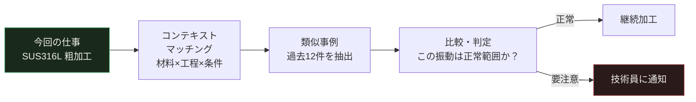

それは火曜日の午後だった。

72時間かけた加工の、71時間目に工具が折れた。

素材はSUS316L。重量68kg。図面は76ページ。
段取りに半日、プログラム確認に2時間、粗加工3日、仕上げ前夜。
納期は翌朝。お客さんはすでに受け入れ検査の準備に入っていた。

工具が折れた瞬間、加工面は使えなくなった。補修できる形状ではなかった。

その後の話はしなくていい。誰もが想像できる。

ただ一つだけ、問いが残った。

**「あの工具が折れる前に、何かがあったはずだ。」**

あった。確かにあった。でも誰も聞いていなかった。

---

## 「IoTは一品一様には使えない」という、半分だけ正しい話

IoTを導入した工場の話を聞いたことがあるかもしれない。電流センサーをつけて、振動を計測して、「異常を検知します」という話だ。

でも、実際にやってみようとすると、こんな疑問が頭をよぎる。

> *「うちは毎回ワークが違う。材料も違う、形状も違う、段取りも違う。そんな現場で"正常値"なんて決められるのか？」*

これは正しい疑問だ。むしろ鋭い疑問だ。

**大量生産向けのIoTは、1000個の同じ部品の平均値を「正常」として使う。**
電流が平均より15%高い→異常。振動が平均より20%大きい→警告。シンプルで確かに効く。1000個の平均が「正常の基準」になるから。

でも一品一様の現場では、毎回が「初めての仕事」だ。SUS316Lの大型ワーク、一度しか作らない。過去の平均値なんてない。

**だから「一品一様にIoTは使えない」——半分だけ正しい。**

残り半分は間違っている。

鍵は**「コンテキスト比較」**だ。

---

## 一品一様IoTの核心：「似た仕事と比べる」

「過去の全仕事の平均」と比べるのをやめる。代わりに、**「今回の仕事に似た条件の過去事例だけ」と比べる。**

今回の仕事が「SUS316L、粗加工、スピンドル回転数800rpm、送り0.25mm/rev」なら、比較対象は過去の「SUS系難削材・粗加工工程・同程度の切削条件」の事例だけに絞る。

その10〜20事例の中で「今回の電流値は上位何%か」「今回の振動レベルは過去事例と比べて高いか低いか」を見る。

これなら、一品一様でも使える。毎回異なるワークでも、**「似た仕事の中での異常」**は検知できる。



そのためにデータに付けておくべき「タグ」がある。

| タグ名 | 意味 | 例 |
|---|---|---|
| `material_lot` | 使った材料のロット | SUS316L-2024-B3 |
| `process_step` | 今どの工程か | `rough_turning`（粗加工） |
| `recipe_rev` | 加工プログラムのバージョン | v2.3 |
| `project_id` | 案件番号 | P-2026-047 |

このタグがあれば、「同じ材料・同じ工程・同じプログラムのバージョン」という条件で過去事例を絞り込める。**一品一様こそ、このコンテキストが命綱になる。**

---

## 機械は8種類の言葉で喋っている

あの71時間目に折れた工具は、折れる前から何かを言っていた。

機械が使う言葉は、8種類ある。

### 言語①：信号灯の色　——「今、俺は動いているか」

三色ランプ（緑・黄・赤）に光センサーを貼る。それだけだ。機械を改造しない。ケーブルも切らない。

記録されるのは：**いつ動いていたか、いつ止まっていたか、何回アラームが出たか。**

「稼働率は体感8割」が、データを見ると6割だった——そういうことが珍しくない。その2割の損失がどこで生まれているかが、初めて見えてくる。これが全ての出発点だ。

> **設置コスト目安：1台あたり 2〜3万円。今週中にできる。**

---

### 言語②：電流　——「俺は今、どれだけ頑張っているか」

スピンドルモーターの動力線に、クランプ式センサーを挟む。工事不要、無停電作業可。15分で設置できる。

モーターが使う電気の量は、**切削抵抗の大きさ**に直結する。

- 新品工具：電流がなめらかで安定
- 摩耗した工具：電流が少しずつ増えていく
- **折損の直前：電流が急に落ちる**（工具が素材に当たらなくなるから）

71時間目に折れた工具は、60時間目あたりから電流の増加が始まっていた。そのパターンは、過去の「同材質・同工程の類似事例」と比べると、明らかに外れ値だった。

誰も見ていなかっただけだ。

> **設置コスト目安：1軸あたり 5,000〜1万円。**

---

### 言語③：重量　——「俺は何を削っているか」

加工前後にワークを計る。削り取った重量が数字になる。

一品一様では、**「この材料、本当に指定の素材か」**という確認が重要だ。材料の取り違えは、重量が一番早く気づく。図面指定より重ければ材料が違うか、余肉が多い。軽すぎれば欠肉の可能性がある。段取り時の確認が自動化できる。

加工後の重量差は「どれだけ削ったか」の実績になり、工程ごとの切削量管理に使える。

> **設置コスト目安：ロードセル型 5,000〜3万円。**

---

### 言語④：振動　——「俺の軸受は今、どんな状態か」

主軸のフロント軸受の近くに加速度センサーを貼る。磁石固定のものなら工事なしで付けられる。

軸受が健全なとき、振動は規則正しい。傷がつくと、その傷が通過するたびに小さな衝撃が出る。その「揺れ方のパターン」を見れば、**傷がついているかどうか**がわかる。

工具のビビリ（加工中に工具が小刻みに震えて表面が波打つ現象）も振動でわかる。ビビリが始まる瞬間、振動信号の特定の周波数が突然大きくなる。気づいた時点で送り速度や回転数を調整すれば、加工面を救える。

工具の摩耗が進むほど振動の大きさが増す。その値を追えば、**「そろそろ交換」というタイミングが客観的に見える。**

> **設置コスト目安：1台あたり 4〜10万円（センサー＋記録機器）。**

---

### 言語⑤：音　——「何かがおかしくなり始めている」

加工室内にマイクを置く。防水・防塵の工業用が必要だが、設置は簡単だ。

音のセンサーが最も力を発揮するのは2つの場面だ。

**ひとつ目：工具折損の瞬間の検出。**
工具が折れる瞬間、音響信号に0.1秒以下の鋭いスパイクが出る。これを検知してスピンドルを即停止させれば、折れた工具が加工面やチャックをさらに傷つけることを防げる。71時間の仕事を守る最後の砦だ。

**ふたつ目：ビビリの早期警告。**
ビビリが始まると、加工音の中に特定の周波数の音が混じる。振動センサーより先に反応するケースが多い。ベテラン技術員が「あの音、おかしい」と感じるあの感覚を、マイクは数値として記録する。

> **設置コスト目安：1台あたり 5,000〜3万円。**

---

### 言語⑥：温度　——「俺は今、熱くなっている」

精密加工をやってきた人なら知っている。**朝イチの機械と、2時間運転後の機械は、同じプログラムで同じ寸法が出ない。**

これが「熱変位」だ。主軸が温まると刃先の位置が数ミクロン単位でずれる。

主軸フロント・リア軸受とモーターの3点に温度センサーを貼ると、そのずれ量を計算で求められるようになる。

```
補正量 = （前軸受の温度 × 係数A）+（後軸受の温度 × 係数B）+ 基準値
```

この「係数A・B」は、その機械固有の値だ。**「この機械は前が先に温まる」「暖機後30分で安定する」——そういうその機械の個性を知っている人間が、係数を決める。** データが、長年の観察を数式に変える。

温度の「上昇速度」を見ることも重要だ。上限値を超えてから気づくより、「急に温まり始めた」ことを察知する方が早い。潤滑不足、冷却液の劣化、過負荷の予兆はここに出る。

> **設置コスト目安：3点で 1〜3万円（熱電対）。**

---

### 言語⑦：位置・RFID　——「このワーク、今どこにいるか」

一品一様の加工では、**「あのワーク、今どの工程にいるか」**が見えなくなることがある。

ワークやパレットにRFIDタグを貼り、各工程の入口に読取機を置く。これだけで、ワークの工程通過履歴が自動記録される。

工具の管理にも使える。工具ホルダーにタグを付ければ、「この工具を合計何時間使ったか」「今どの機械に入っているか」が追跡できる。**工具棚卸しが、システムを見るだけで完了する。**

一品一様で最も怖いのは段取りミスだ。「このワークにはこのプログラム」という紐付けをRFIDで管理すれば、間違ったプログラムを呼び出した瞬間に警告が出る。それだけで、取り返しのつかないミスを一つ防げる。

> **設置コスト目安：タグ1枚500〜2,000円、読取機1台3〜10万円。**

---

### 言語⑧：画像　——「仕上がりはどうか」

工業用カメラとリングライトを加工完了ポジションに設置する。8種の中で最も投資が大きいが、**「見て判断する作業」を自動化できる唯一のセンサーだ。**

加工面のバリ・キズ・工具刃先の状態——今は人の目でやっている全数確認を、カメラが担う。AIは「良品」「不良品」と人が判断したサンプルを数百枚学習すれば、その判断を自動で再現する。

重要なのは：**目利きは人間がやる。全数チェックのスピードは機械がやる。**

工具刃先を撮影して「刃先がどれだけ丸まったか」を数値化し、電流・振動データと組み合わせると、工具寿命の予測精度が大幅に上がる。

> **設置コスト目安：カメラ＋照明＋PC 1セット 20〜80万円。**

---

## センサーがあれば、あの仕事は救えたのか

71時間目に折れた工具の話に戻る。

もし電流センサーと振動センサーがあったなら、こんなことが起きていた可能性がある。

**60時間目ごろ：** 電流値が、過去の類似事例（SUS系・粗加工・同程度の切削条件）の上位15%に入り始める。システムが「要注意」をスマートフォンに通知。

**65時間目：** 振動のRMSが通常より20%増加。「工具摩耗の進行が早い可能性があります」と表示。

**技術員の判断：** 「仕上げ前に一度工具を確認しよう」

**70時間目：** 工具を確認。摩耗が予想より進んでいる。交換を決断。

**71時間目：** 新しい工具で仕上げ加工開始。

**72時間目：** 完成。納期通り。

センサーは「工具を交換しろ」とは言わない。工具を交換するかどうかを決めるのは、あなただ。センサーは「今、こういう状態になっています」と事実を伝える。**判断はあなたがする。** センサーはそのための情報を作る。

---

## あなたの仕事が「なくなる」のではなく、「変わる」

率直に言う。こう思っているかもしれない。

*「センサーを入れて、AIが全部やるようになったら、俺の仕事はどうなるんだ。」*

答えを言う。

**AIは、図面を見てワークの持ち方を考えられない。**
**AIは、材料が図面スペックより硬いと感じ取れない。**
**AIは、「このお客さんはここを特に気にする」という背景を読めない。**
**AIは、難しい形状に対して「こういうアプローチはどうだ」と発想できない。**

一品一様の加工の価値は、そこにある。まったく同じ部品を量産するなら、とっくに自動化されている。あなたの現場に一品一様の仕事が来るのは、**それが難しいから**だ。

では今、あなたの仕事の中で何に一番エネルギーを使っているか。

難しい判断か。それとも「軸受の音が変じゃないか」という監視か。

センサーは監視を引き受ける。あなたの集中力を、判断のために空ける。それだけだ。

**監視は、最も重要な仕事の中の最も退屈な部分だ。センサーに渡せる。**

---

## あなたの感覚が、工場の資産になる

センサーを付けてデータが集まり始めると、次にやることがある。

ラベル付けだ。

「この電流パターンが出たとき、どうしたか」——「工具を確認したら摩耗末期だったので交換した」
「この振動値のとき、仕上げ面はどうだったか」——「わずかにビビリ痕が出ていた」
「この温度の上昇速度を見て、どう判断したか」——「冷却液の濃度を確認して2%補正した」

このラベルを付けられるのは、あなただけだ。

その判断が、50回分・100回分積み上がると、AIは「この状況ではどう動くか」を学習できる。**あなたの感覚が、モデルに変換されて工場に残る。** あなたが異動しても、退職しても、その判断のパターンは生き続ける。

「30年かけて体に染み込んだ感覚」に、初めて居場所ができる。

---

## 数字で見る：既存設備3台に乗せたとき

信号灯＋電流センサーを3台の既存設備に乗せた場合の試算。

| 項目 | 費用 |
|---|---|
| 信号灯センサー（3台） | 約 6万円 |
| 電流センサー（3台×2軸） | 約 12万円 |
| エッジゲートウェイ（1台） | 約 15万円 |
| 設置・配線工事（3日） | 約 15万円 |
| ソフトウェア・クラウド（初年度） | 約 72万円 |
| **合計** | **約 120万円** |

一品一様の仕事で**加工中にワーク1個が全損したとき**のコストを考えてほしい。

材料費、加工時間（機械時間＋技術員工数）、外注費、納期遅延の対応費用、信用損失——大型ワークなら、1件で数百万円を超えることがある。

センサー全体の初期投資が120万円で、**1件の全損を防げれば元が取れる。** それが何年かに1回起きている現場なら、話は早い。

計画外停止の削減だけでも、**年間効果140〜280万円（20〜40%停止削減）**という試算がある。投資回収は5〜10か月だ。

---

## 1年後、3年後、5年後

### 1年後：「なぜ止まったか」が全部説明できるようになる

停止の原因、工具交換のタイミング、電流の変化、全てがログに残る。「先月の生産効率が落ちた理由」を、感覚ではなくデータで説明できるようになる。

### 3年後：新しい設備は「最初からつながって生まれてくる」

3年のデータが蓄積されると、設備投資の判断基準が変わる。「次に入れる機械はOPC UA（機械の標準通信規格）に対応しているか」「センサーポートはあるか」が購入条件に入る。新設備は設置した瞬間からデータが流れ始め、古い設備は後付けセンサーで「つなぎ直される」。工場が、少しずつオンラインになっていく。

### 5年後：機械が「一品ごとに自分で設定を変える」


これが一品一様の自律製造だ。完全に自動ではない。機械が監視して、提案して、人間が最終判断をする。そのサイクルが回るたびに、蓄積データが増え、次の判断精度が上がる。

技術員の役割は変わらない。**変わるのは、あなたの判断の「重さ」だ。** 今まで監視に使っていた集中力が全て判断に向かうようになる。

---

## 今週できること

大規模なIoTプロジェクトを立ち上げる必要はない。

**今週できることは、信号灯に光センサーを1台につけることだ。**

設置時間：1時間。コスト：2〜3万円。設置後すぐにわかること：「今週、この機械は何時間動いていたか」。

それだけで何かが変わる。「体感で8割稼働だと思っていた機械が6割だった」——その事実を見た瞬間から、次の問いが生まれる。「残り2割はどこで失われているのか」。

その問いが、センサーを増やす理由になる。

---

## 付録：8センサー 設置チェックリスト（回転体加工機 版）

```
【第1フェーズ：今すぐ　〜3か月】

□ 信号灯センサー
  ├─ 設置：既設ランプのレンズ面に光センサーを貼付
  ├─ 記録：緑（稼働）黄（準備/段取）赤（アラーム）消灯（停止）
  └─ 活用：稼働率・停止時間・停止理由の自動記録

□ 電流センサー（CTクランプ型）
  ├─ 設置：スピンドル動力線にクランプ（無停電作業可）
  ├─ レンジ：定格電流の1.5倍まで計測可能なもの
  └─ 活用：工具摩耗監視・折損検知・切削負荷管理

【第2フェーズ：6か月後〜1年】

□ 振動センサー（加速度センサー）
  ├─ 設置：主軸フロント軸受ハウジング上面・金属面直付け
  ├─ 性能：周波数10Hz〜10kHz以上、サンプリング10kHz以上
  └─ 活用：軸受診断・ビビリ検出・工具摩耗進行度

□ 温度センサー（熱電対）
  ├─ 設置：主軸フロント軸受・リア軸受・モーター端面の3点
  ├─ 性能：0〜150℃、応答30秒以内
  └─ 活用：熱変位補正・軸受過熱早期検知（dT/dt監視）

□ 音響センサー（工業用マイク IP54以上）
  ├─ 設置：加工室内・工具接触部から0.5m以内
  ├─ 性能：100Hz〜20kHz
  └─ 活用：工具折損即時検知・ビビリ早期警報

□ 重量センサー（ロードセル）
  ├─ 設置：ワーク置き台下部
  ├─ 精度：用途に応じて ±0.1g〜±10g
  └─ 活用：材料確認・加工量管理・段取りミス防止

【第3フェーズ：1〜2年後】

□ 位置・RFIDセンサー
  ├─ 設置：タグをワーク・工具ホルダーに貼付。読取機を工程入口に
  ├─ 性能：耐熱・耐油・耐切削液仕様のタグ
  └─ 活用：工程追跡・工具使用時間管理・段取りミス防止・棚卸自動化

□ 画像センサー（工業用カメラ＋リングライト）
  ├─ 設置：加工完了ポジションに固定マウント
  ├─ 性能：最小検査対象の10倍以上の分解能
  └─ 活用：外観自動検査・工具刃先摩耗計測・AI学習による判定自動化
```

---

72時間かけた仕事を守るために必要な情報は、機械がずっと出し続けていた。

聞く仕組みを作るだけでよかった。

8種の言葉で喋り続けている機械に、今日から耳を傾けてみてほしい。
